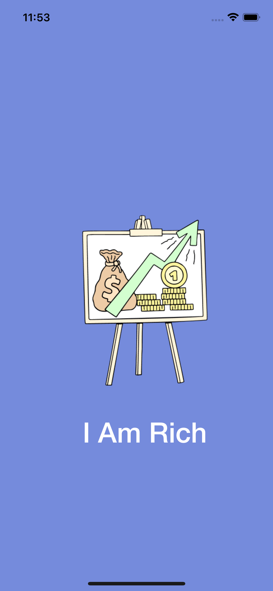
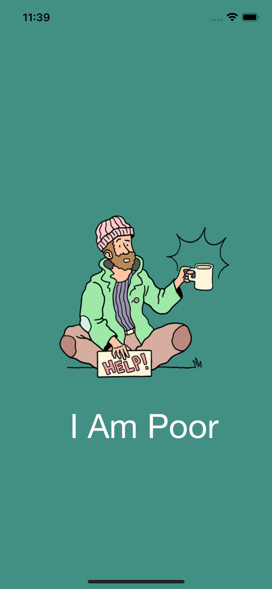

# Section 2: XCode Storyboards and Interface Builder

This section introduces XCode Storyboards and the Interface Builder. To practice and understand the concepts, we built a couple of very simple apps that display a title along with an image on the screen. We also generated sets of icon for different type of devices.

Finally, we were able to launch the app via the Device Simulator as well as on our physical iPhone.

## The "I Am Rich" App

## The "I Am Poor" App

